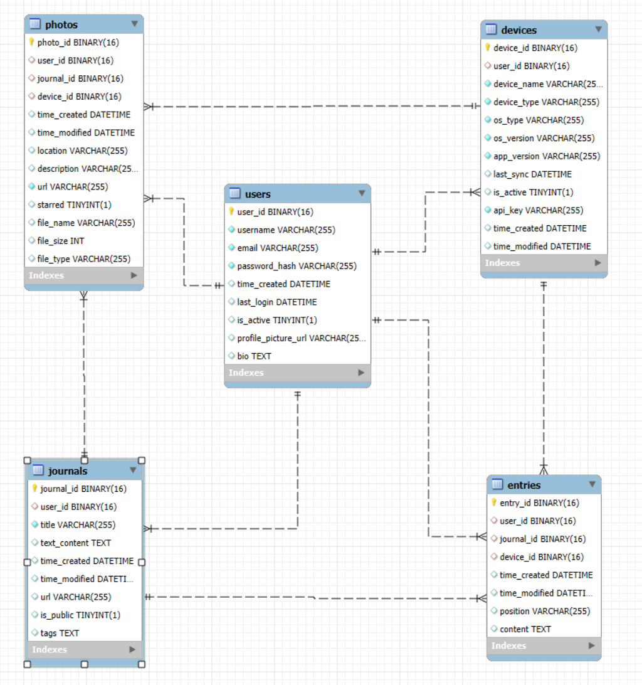

# Backend for VMBook project

## Quick Start

### Installing MySQL

Install MySQL from the official download page `https://dev.mysql.com/downloads/installer/`
This project is using version `8.0.38`.

Initialize MySQL:

```cmd
cd C:\mysql\mysql-portable\bin
mysqld --initialize-insecure
```

Start the MySQL server in the console: 
```cmd
mysqld --console
```

### Create DB

Run `create_tables.py` in `scripts` folder.


## Stacks

- FastAPI
- MySQL

## Todos

- [x] Database design: user, device, journal, picture, text entry
- [x] MySQL Connection and create tables
- [ ] Endpoint Design
- [ ] Journal Generate


## Data Model




<!-- ### User

| Column Name | Data Type | Description |
|-------------|-----------|-------------|
| user_id     | UUID      | Primary Key |
| username    | STRING    | Unique username |
| email       | STRING    | Unique email address |
| password_hash| STRING   | Hashed password |
| time_created| DATETIME  | Account creation timestamp |
| last_login  | DATETIME  | Last login timestamp |
| is_active   | BOOLEAN   | Flag for active/inactive account |
| profile_picture_url | STRING | URL to user's profile picture |
| bio         | TEXT      | User's biography or description |


### Device

| Column Name | Data Type | Description |
|-------------|-----------|-------------|
| device_id   | UUID      | Primary Key |
| user_id     | UUID      | Foreign Key to user table |
| device_name | STRING    | Name of the device |
| device_type | STRING    | Type of device (e.g., 'smartphone', 'tablet', 'embedded') |
| os_type     | STRING    | Operating system of the device |
| os_version  | STRING    | Version of the operating system |
| app_version | STRING    | Version of the app installed on the device |
| last_sync   | DATETIME  | Timestamp of the last synchronization |
| is_active   | BOOLEAN   | Flag indicating if the device is currently active |
| api_key     | STRING    | Unique API key for this device |
| time_created| DATETIME  | When the device was first registered |
| time_modified| DATETIME | When the device information was last updated |

### Journal 

| Column Name | Data Type | Description |
|-------------|-----------|-------------|
| journal_id  | UUID      | Primary Key |
| user_id     | UUID      | Foreign Key to user table |
| title       | STRING    | Title of the journal |
| text_content| TEXT      | Main content of the journal |
| time_created| DATETIME  | Creation timestamp |
| time_modified| DATETIME | Last modification timestamp |
| url         | STRING    | URL of the journal |
| is_public   | BOOLEAN   | Flag for public/private visibility |
| tags        | TEXT[]    | Array of tags for categorization |

## Photo

| Column Name | Data Type | Description |
|-------------|-----------|-------------|
| photo_id    | UUID      | Primary Key |
| user_id     | UUID      | Foreign Key to journal table |
| journal_id  | UUID      | Foreign Key to journal table |
| device_id  | UUID      | Foreign Key to device table |
| time_created| DATETIME  | Creation timestamp |
| time_modified| DATETIME | Last modification timestamp |
| location    | STRING    | Location where the photo was taken |
| description | STRING    | Description of the photo |
| url         | STRING    | URL of the photo |
| starred     | BOOLEAN   | Flag for starred/favorite photos |
| file_name   | STRING    | Original file name |
| file_size   | INTEGER   | Size of the file in bytes |
| file_type   | STRING    | MIME type of the file |

## Entry (separate text entry)

| Column Name | Data Type | Description |
|-------------|-----------|-------------|
| entry_id    | UUID      | Primary Key |
| user_id  | UUID      | Foreign Key to user table |
| user_id  | UUID      | Foreign Key to device table |
| journal_id  | UUID      | Foreign Key to journal table |
| time_created| DATETIME  | Creation timestamp |
| time_modified| DATETIME | Last modification timestamp |
| position    | STRING    | Position of the entry in the journal |
| content     | STRING    | Content of the entry | -->


## API Endpoints

Your database design includes tables for users, devices, photos, journals, and entries. Here's an example of how you could design RESTful API endpoints for these resources:

### Users
- `GET /users` - Retrieve a list of all users
- `GET /users/{userId}` - Retrieve details about a specific user
- `POST /users` - Create a new user
- `PUT /users/{userId}` - Update an existing user
- `DELETE /users/{userId}` - Delete a user

### Devices
- `GET /users/{userId}/devices` - Retrieve all devices for a specific user
- `GET /users/{userId}/devices/{deviceId}` - Retrieve details about a specific device
- `POST /users/{userId}/devices` - Add a new device to a user
- `PUT /users/{userId}/devices/{deviceId}` - Update a specific device
- `DELETE /users/{userId}/devices/{deviceId}` - Delete a device

### Photos
- `GET /users/{userId}/photos` - Retrieve all photos for a user
- `GET /photos/{photoId}` - Retrieve a specific photo
- `POST /users/{userId}/photos` - Upload a new photo for a user
- `DELETE /photos/{photoId}` - Delete a specific photo
- `GET /photos/{photoID}/analyze` - Describe a specific photo

### Journals
- `GET /users/{userId}/journals` - Retrieve all journals for a user
- `GET /journals/{journalId}` - Retrieve details of a specific journal
- `POST /users/{userId}/journals` - Create a new journal for a user
- `PUT /journals/{journalId}` - Update a journal
- `DELETE /journals/{journalId}` - Delete a journal

### Text Entries
- `GET /journals/{journalId}/entries` - Retrieve entries in a journal
- `GET /entries/{entryId}` - Retrieve a specific entry
- `POST /journals/{journalId}/entries` - Add an entry to a journal
- `PUT /entries/{entryId}` - Update an entry
- `DELETE /entries/{entryId}` - Delete an entry
